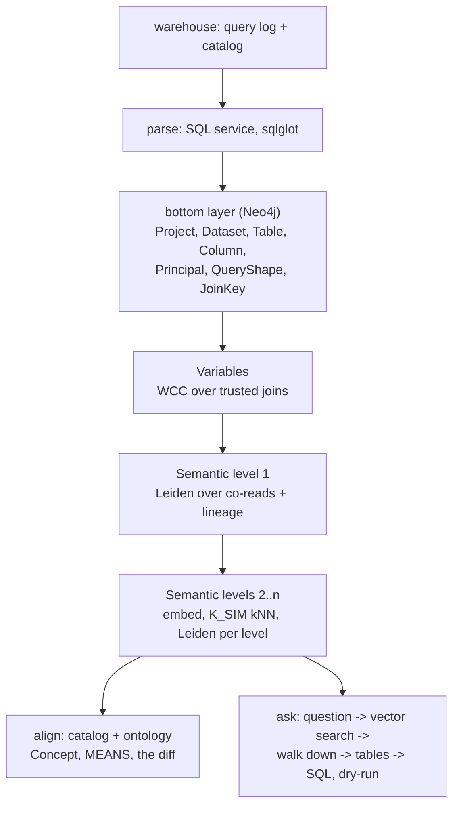

# qlsc: a semantic layer from the query log

qlsc builds a semantic layer for a data warehouse from **how the business actually uses it**: the query
log. A Neo4j graph records which columns queries join, read together and derive from one another.
Columns joined to each other become one Variable; communities of what is read together become business
areas, level above level; an LLM names them. A question in plain English then walks down from those
areas to the tables and columns that answer it.

The premise: ERDs, catalogs and ontologies are someone's design; the query log is what the business
runs. So usage is the ground truth, and designed models are aligned afterwards, never used as inputs
([docs/design.md](docs/design.md)).



## Try it

The worked example is **Fennmoor Bank**, a synthetic US retail bank on BigQuery with a 90-day query log
of 315,729 jobs, planted traps, a data catalog and an ontology. The tutorial walks through it end to
end: [examples/fennmoor-bank/](examples/fennmoor-bank/README.md).

What it finds there: 50 variables built only from trusted joins; semantic levels of 109 → 16 → 5
groups (median group stability 0.95); every join and lineage edge in the answer key recovered; all
three planted wrong catalog bindings surfaced by the alignment.

## Use it

Prerequisites: Docker; [uv](https://docs.astral.sh/uv/); access to the warehouse's query log and
catalog (BigQuery today: `gcloud`); an Anthropic API key and an Azure OpenAI `text-embedding-3-large`
deployment; Neo4j Enterprise and GDS license files (not included).

```bash
cp .env.example .env                  # passwords, keys, and QLSC_CONFIG: your estate's config file
docker compose up -d neo4j parser     # add --profile nes for Enterprise Studio
uv sync
```

Write a config for your estate, following
[examples/fennmoor-bank/estate.yaml](examples/fennmoor-bank/estate.yaml): the warehouse connector and
where its log is, how to normalize volatile table names, the Neo4j database, and optionally a catalog
export and an ontology. Then:

```bash
uv run qlsc extract                   # the aggregated log and the catalog snapshot, from the warehouse
uv run qlsc build                     # parse, load, variables, cluster, hierarchy, align
uv run qlsc ask "How many customers use the mobile app each week?"
```

Each stage also runs on its own (`uv run qlsc --help`). A full LLM naming pass costs under $0.50 with
Claude Haiku 4.5, and every call is cached by its request, so rebuilds are free and reproduce the graph
exactly.

## Repository

| Path | What |
|---|---|
| `src/qlsc/` | The pipeline, one module per stage, and the `qlsc` command |
| `src/qlsc/defaults.yaml` | Every model and method parameter, in one place |
| `src/qlsc/warehouse/` | Warehouse connectors: the only code that talks to a warehouse (BigQuery) |
| `parser/` | The SQL parse service (sqlglot, compiled), one image for docker-compose, Cloud Run or Lambda, with golden tests |
| `prompts/` | Every LLM prompt, one file each ([prompts/README.md](prompts/README.md)) |
| `docs/design.md` | The principle, the graph model, the method, the parameters and their sensitivity |
| `examples/fennmoor-bank/` | The worked example: the bank's spec, its generators, designed models, evaluations, demo queries |
| `tests/` | `uv run pytest`: the tool/example boundary, prompts, config, the method's pure parts, the demo queries |
| `plans/` | Agreed plans for work in progress ([plans/README.md](plans/README.md)) |
| `CLAUDE.md` | Standing context for AI coding agents: principles, conventions, commands, safety rules |
| `docker/`, `docker-compose.yml` | Neo4j Enterprise with GDS and APOC, the parse service, optionally Enterprise Studio |

To add a warehouse, subclass `Warehouse` in `src/qlsc/warehouse/` and list it in `CONNECTORS`; the
parser resolves BigQuery SQL only so far.
