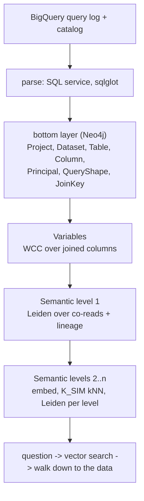

# Query-log semantic layer

Build a semantic layer for a data warehouse from **how the business actually uses it**: the
query log. A Neo4j graph records which columns queries join, read together and derive from one
another. Communities in that graph become business areas, the LLM names them, and a question in
plain English walks down from those areas to the tables and columns that answer it.

The premise: ERDs, catalogs and ontologies are someone's design. The query log is what the
business actually runs. So usage is the ground truth, and designed models are treated as later
enhancements, never as inputs.

The demo runs on **Fennmoor Bank**, a synthetic US retail bank on BigQuery. Its spec (`specs/`)
has 324 tables across 43 datasets, dbt and Looker models, legacy and sandbox mess, and planted
traps. A simulator produces a realistic 90-day `INFORMATION_SCHEMA.JOBS` log (315,729 jobs) from
the spec. The pipeline reads only that log and BigQuery's catalog, never the spec; the spec is
used to generate the log and to grade the result.

## How it works



1. **Bottom layer:** only what the log and catalog show directly (`pipeline/load_graph.py`).
   - Seven labels: Project, Dataset, Table, Column, Principal (who ran it), QueryShape (a
     distinct query, with its run counts), and JoinKey (a join predicate).
   - Relationships record which columns each query reads, filters (with the values it
     filtered on), joins and writes, plus column lineage (`FLOWS`).
2. **Variables** (`pipeline/variables.py`): columns joined to each other hold the same
   real-world thing. WCC over the join graph (GDS) gives one `Variable` per component, named
   by Claude. Columns that are never joined are labelled `:Unjoined`.
3. **Semantic level 1** (`pipeline/cluster.py`): pure usage.
   - Variables and unjoined columns are linked when one query reads both, or when lineage
     connects them.
   - Leiden (gamma 4) turns these links into groups, and Claude names each group.
4. **Higher levels** (`pipeline/hierarchy.py`), repeated for each new level L:
   - Embed each group (text-embedding-3-large, 512 dimensions).
   - Score each pair: `(1/L) × usage + (1 − 1/L) × text similarity`, so language takes over as
     the levels rise.
   - Link each node to its 5 best matches (`K_SIM`), then run Leiden with gamma `3/(L−1)`.
   - Stop when a level would not shrink.

   Upper-level names avoid vendor names, so two organizations' semantic layers can be matched
   at the top by embedding similarity.
5. **Navigate** (`pipeline/navigate.py`):
   - A question is embedded and vector-searched against the semantic layer.
   - The search walks `IN_SEMANTIC` down to the level-1 groups, then to the tables and columns
     they hold, ranked by how many principals use them.
   - It finishes with the joins and existing queries in the log that connect them.

Current result on Fennmoor: 53 variables; semantic levels of 110 → 16 → 5 groups. Every LLM prompt
is a file in [`prompts/`](prompts/).

## Status

The bottom layer and the semantic hierarchy above run on the new seven-label model, in the Neo4j
database `bigquery` (decision D9 in [plans/PIPELINE_PLAN.md](plans/PIPELINE_PLAN.md)).

An earlier, richer build ran milestones M1 to M6, with scores in `specs/build/score/`. It covered
actor classes, join confidence, lifecycle findings, table guidance, a question-answering agent and
Enterprise Studio views. It lives in the `semanticlayer` database, and its stages
(`actors.py`, `detect.py`, `topology.py`, `semantics.py`, `guide.py`, `tools.py`, `answer.py`,
`views.py`) still read that model. They are being rebuilt on the new one. The `plans/` folder
documents each milestone.

## Repository

| Path | What |
|---|---|
| `pipeline/` | The pipeline: extract, parse, load, variables, semantic levels, navigation ([pipeline/README.md](pipeline/README.md)) |
| `pipeline/parser/` | SQL parse service (sqlglot, compiled), the same image for docker-compose or Cloud Run / Lambda, with golden tests |
| `prompts/` | Every LLM prompt, one file each ([prompts/README.md](prompts/README.md)) |
| `plans/` | The pipeline plan, decisions and per-milestone write-ups |
| `specs/` | The Fennmoor Bank spec, the log simulator and the scorer ([specs/README.md](specs/README.md)) |
| `cypher/` | Enterprise Studio setup and saved view queries |
| `docker-compose.yml` | Neo4j Enterprise with GDS and APOC, the parse service, and optionally Enterprise Studio |
| `IMPROVEMENTS.md` | The original assessment that started this rebuild |

## Running it

Prerequisites:
- Docker;
- [uv](https://docs.astral.sh/uv/) (every script declares its own dependencies);
- `gcloud` with access to a BigQuery project;
- an Anthropic API key and an Azure OpenAI `text-embedding-3-large` deployment;
- Neo4j Enterprise and GDS license files (not included).

```bash
cp .env.example .env                  # fill in passwords and keys
docker compose up -d neo4j parser     # add --profile nes for Enterprise Studio
```

Create the target database and point `pipeline/estate.yaml` at your BigQuery project, gcloud
configuration and Neo4j. Then:

```bash
# 1. The estate and its query log (spec side; see specs/GCP_SETUP.md)
uv run specs/tools/build.py
uv run specs/tools/deploy.py --project <your-project>
uv run specs/tools/simulate.py --validate 400 --load

# 2. The pipeline (reads only the log and the catalog)
uv run pipeline/extract.py            # aggregate the log inside BigQuery, snapshot the catalog
pipeline/run.sh                       # parse, load, score, variables, semantic levels

# 3. Ask
uv run pipeline/navigate.py "How many customers use the mobile app each week?"
```

Cost: BigQuery is effectively free (empty tables, dry runs, one aggregated log pull). A full
LLM naming pass costs under $0.50 with Claude Haiku 4.5, and every call is cached by its request,
so rebuilds are free.
