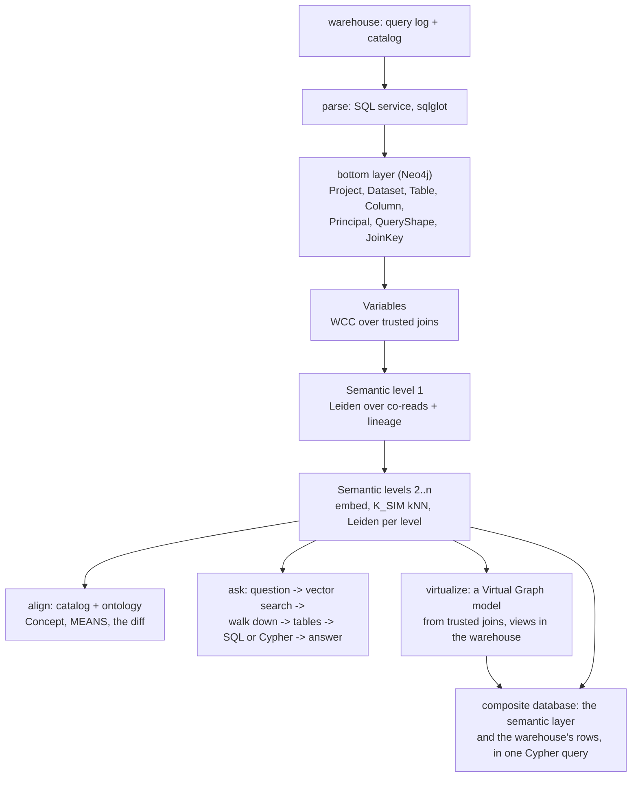

# qlsc: a semantic layer from the query log

qlsc builds a semantic layer for a data warehouse from **how the business actually uses it**: the query
log. A Neo4j graph records which columns queries join, read together and derive from one another.
Columns joined to each other become one Variable; communities of what is read together become business
areas, level above level; an LLM names them. A question in plain English then walks down from those
areas to the tables and columns that answer it.

The semantic layer also writes a **Neo4j Virtual Graph** model of the warehouse, so the warehouse's
rows can be queried as a graph without copying them. Its nodes and relationships come from the log's
trusted joins, and the joins the log shows to be suspect are left out. A **composite database** puts
the two side by side: one Cypher query reads what the layer knows about a table (its business area,
its Variables, which column a relationship comes from) together with the live rows from BigQuery.

The premise: ERDs, catalogs and ontologies are someone's design; the query log is what the business
runs. So usage is the ground truth, and designed models are aligned afterwards, never used as inputs
([docs/design.md](docs/design.md)).



## Try it

The worked example is **Fennmoor Bank**, a synthetic US retail bank on BigQuery with a 90-day query log
of 315,729 jobs, planted traps, a data catalog and an ontology. The tutorial walks through it end to
end: [examples/fennmoor-bank/](examples/fennmoor-bank/README.md).

What it finds there: 50 variables built only from trusted joins; semantic levels of 109 → 16 → 5
groups (median group stability 0.95); every join and lineage edge in the answer key recovered; all
three planted wrong catalog bindings surfaced by the alignment.

## Use it

Prerequisites: Docker; [uv](https://docs.astral.sh/uv/); access to the warehouse's query log and
catalog (BigQuery today: `gcloud`); an Anthropic API key and an Azure OpenAI `text-embedding-3-large`
deployment; Neo4j Enterprise and GDS license files (not included).

```bash
cp .env.example .env                  # passwords, keys, and QLSC_CONFIG: your estate's config file
docker compose up -d neo4j parser     # add --profile nes for Enterprise Studio
uv sync
```

Write a config for your estate, following
[examples/fennmoor-bank/estate.yaml](examples/fennmoor-bank/estate.yaml): the warehouse connector and
where its log is, how to normalize volatile table names, the Neo4j database, and optionally a catalog
export and an ontology. Then:

```bash
uv run qlsc extract                   # the aggregated log and the catalog snapshot, from the warehouse
uv run qlsc build                     # parse, load, variables, cluster, hierarchy, align
uv run qlsc ask "How many customers use the mobile app each week?"
uv run qlsc ask --run "..."           # and run it: the answer, billed up to a cap
uv run qlsc ask --cypher --run "..."  # Cypher over the virtual graph instead of SQL (below)
```

Each stage also runs on its own (`uv run qlsc --help`). A full LLM naming pass costs under $0.50 with
Claude Haiku 4.5, and every call is cached by its request, so rebuilds are free and reproduce the graph
exactly.

## The warehouse as a graph: Virtual Graph and the composite database

`qlsc virtualize` turns the semantic layer into a model for
[Neo4j Virtual Graph](https://neo4j.com/docs/virtual-graph/) (preview). Virtual Graph answers Cypher by
translating it to SQL for the warehouse, so there's no copy of the data to keep in sync.
- **Nodes:** each is a table that a Variable's trusted joins converge on, or that production's pipelines
  MERGE on.
- **Relationships:** each is a column holding another node's key.
- **Names:** from the LLM.
- **Output:** one view per node table, in a dataset of its own, and a report of the evidence for every
  choice.

A composite database, `fennmoor`, on the Virtual Graph instance has two constituents:
- `fennmoor.semantic`: the semantic layer;
- `fennmoor.rows`: the virtual graph.

So a query can put what the layer knows beside the rows it describes:

```cypher
CALL () {                                   // the semantic layer: where this relationship comes from
  USE fennmoor.semantic
  MATCH (t:Table {graph_label: 'Call'})-[:HAS_COLUMN]->(c:Column {graph_relationship: 'SERVICED_AT'}),
        (c)-[:IS]->(v:Variable)-[:IN_SEMANTIC]->(g:Semantic)
  RETURN g.name AS business_area, v.name AS variable, t.name + '.' + c.name AS column
}
CALL () {                                   // the warehouse: live rows, through Virtual Graph
  USE fennmoor.rows
  MATCH (call:Call)-[:SERVICED_AT]->(s:ContactCenterSite)
  WHERE call.is_account_closure_call = true
  RETURN s.site_name AS site, count(call) AS closure_calls
}
RETURN business_area, variable, column, site, closure_calls ORDER BY closure_calls DESC
```

On the Fennmoor example this returns three rows in about 2 seconds, one per site, each showing:
- the business area (Contact Center Call Operations);
- the Variable (Contact Center Site);
- the column the relationship comes from (`fct_calls.site_id`);
- that site's closure calls, counted in BigQuery (986 at Tulsa, 848 at Manila, 614 at Spokane).

```bash
uv run qlsc virtualize                          # the model, the views, and MODEL.md, in the work directory
docker compose --profile vg up -d neo4j-vg      # Virtual Graph on bolt 7692, Browser on 7478
```

Setup, credentials and the composite's aliases: [docker/nvg/README.md](docker/nvg/README.md).

Virtual Graph is in preview, and three limits apply today:
- **Remote aliases only.** Both constituents are remote aliases, so both Neo4j instances serve bolt
  TLS ([docker/tls/README.md](docker/tls/README.md)). A local alias to the virtual graph fails silently.
- **No values across constituents.** A subquery can't pass a value from the semantic layer into the
  virtual graph; send it as a parameter on a second query instead.
- **A Cypher subset.** Virtual Graph has no `OPTIONAL MATCH` and no variable-length paths.

`qlsc ask --cypher` uses the virtual graph as a second route to an answer. The semantic trace is
the same, and it names the labels to query: the cohort's tables that are labels in the virtual graph,
plus one hop around them.

The findings are in [plans/2026-09-26-virtual-graph-spike.md](plans/2026-09-26-virtual-graph-spike.md).

## Repository

| Path | What |
|---|---|
| `src/qlsc/` | The pipeline, one module per stage, and the `qlsc` command |
| `src/qlsc/defaults.yaml` | Every model and method parameter, in one place |
| `src/qlsc/warehouse/` | Warehouse connectors: the only code that talks to a warehouse (BigQuery) |
| `parser/` | The SQL parse service (sqlglot, compiled), one image for docker-compose, Cloud Run or Lambda, with golden tests |
| `prompts/` | Every LLM prompt, one file each ([prompts/README.md](prompts/README.md)) |
| `docs/design.md` | The principle, the graph model, the method, the parameters and their sensitivity |
| `examples/fennmoor-bank/` | The worked example: the bank's spec, its generators, designed models, evaluations, demo queries |
| `tests/` | `uv run pytest`: the tool/example boundary, prompts, config, the method's pure parts, the demo queries |
| `plans/` | Agreed plans for work in progress ([plans/README.md](plans/README.md)) |
| `CLAUDE.md` | Standing context for AI coding agents: principles, conventions, commands, safety rules |
| `docker/`, `docker-compose.yml` | Neo4j Enterprise with GDS and APOC, the parse service, optionally Enterprise Studio and a Virtual Graph instance (`--profile vg`) |

To add a warehouse, subclass `Warehouse` in `src/qlsc/warehouse/` and list it in `CONNECTORS`; the
parser resolves BigQuery SQL only so far.
