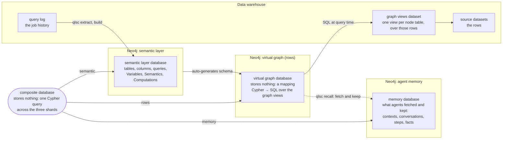
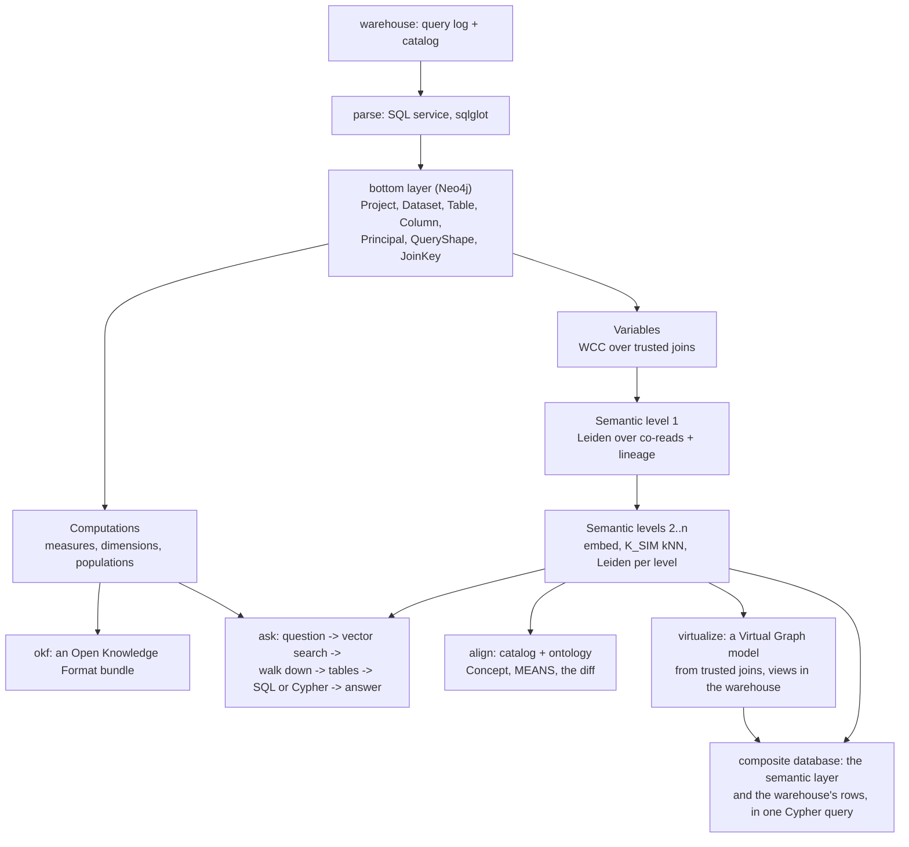

# qlsc: a semantic layer from the query log

qlsc builds a semantic layer for a data warehouse from **how the business actually uses it**: the query
log. A Neo4j graph records which columns queries join, read together and derive from one another.
Columns joined to each other become one Variable; communities of what is read together become business
areas, level above level; an LLM names them. A question in plain English then walks down from those
areas to the tables and columns that answer it.

It also finds what the business **computes**: every measure, derived dimension and population the log's
queries compute, as Computation nodes, named and linked to the columns they read. Those publish as an
**Open Knowledge Format** bundle (OKF v0.2), for any agent or catalog to read.

The semantic layer also writes a **Neo4j Virtual Graph** model of the warehouse, so the warehouse's
rows can be queried as a graph without copying them. Its nodes and relationships come from the log's
trusted joins, and the joins the log shows to be suspect are left out. A **composite database** puts
the two side by side: one Cypher query reads what the layer knows about a table (its business area,
its Variables, which column a relationship comes from) together with the live rows from BigQuery.

The premise: ERDs, catalogs and ontologies are someone's design; the query log is what the business
runs. So usage is the ground truth, and designed models are aligned afterwards, never used as inputs
([docs/design.md](docs/design.md)).

The pieces: three Neo4j shards, queried as one through a composite database. The semantic layer and agent
memory store data; the virtual graph stores none (it maps Cypher to SQL over the warehouse's rows), and nor
does the composite.


```mermaid
flowchart LR
 subgraph W["Data warehouse"]
        R["source datasets<br>the rows"]
        V["graph views dataset<br>one view per node table, over those rows"]
        L["query log<br>the job history"]
  end
 subgraph SEM["Neo4j: semantic layer"]
        S["semantic layer database<br>tables, columns, queries,<br>Variables, Semantics, Computations"]
  end
 subgraph VGR["Neo4j: virtual graph (rows)"]
        G["virtual graph database<br>stores nothing: a mapping<br>Cypher → SQL over the graph views"]
  end
 subgraph MEMG["Neo4j: agent memory"]
        MEM["memory database<br>what agents fetched and kept:<br>contexts, conversations, steps, facts"]
  end
    L -- qlsc extract, build --> S
    V --> R
    G -- SQL at query time --> V
    G -. qlsc recall: fetch and keep .-> MEM
    C(["composite database<br>stores nothing: one Cypher query<br>across the three shards"]) -- semantic --> S
    C -- rows --> G
    C -- memory --> MEM
    SEM -- "auto-generates schema" --> G
```

How the layer is built and used:


```mermaid
flowchart TD
    L[warehouse: query log + catalog] --> P[parse: SQL service, sqlglot]
    P --> B["bottom layer (Neo4j)<br/>Project, Dataset, Table, Column,<br/>Principal, QueryShape, JoinKey"]
    B --> V["Variables<br/>WCC over trusted joins"]
    V --> S1["Semantic level 1<br/>Leiden over co-reads + lineage"]
    B --> CP["Computations<br/>measures, dimensions, populations"]
    CP --> OKF["okf: an Open Knowledge Format bundle"]
    CP --> Q
    S1 --> SH["Semantic levels 2..n<br/>embed, K_SIM kNN, Leiden per level"]
    SH --> A["align: catalog + ontology<br/>Concept, MEANS, the diff"]
    SH --> Q["ask: question -> vector search -><br/>walk down -> tables -> SQL or Cypher -> answer"]
    SH --> VG["virtualize: a Virtual Graph model<br/>from trusted joins, views in the warehouse"]
    VG --> C["composite database: the semantic layer<br/>and the warehouse's rows, in one Cypher query"]
    SH --> C
```

## Try it

The worked example is **Fennmoor Bank**, a synthetic US retail bank on BigQuery with a 90-day query log
of 315,729 jobs, planted traps, a data catalog and an ontology. The tutorial walks through it end to
end: [examples/fennmoor-bank/](examples/fennmoor-bank/README.md).

What it finds there: 50 variables built only from trusted joins; semantic levels of 109 → 15 → 4
groups (median group stability 0.95); every join and lineage edge in the answer key recovered; all
three planted wrong catalog bindings surfaced by the alignment.

## Use it

Prerequisites: Docker; [uv](https://docs.astral.sh/uv/); access to the warehouse's query log and
catalog (BigQuery today: `gcloud`); an Anthropic API key and an Azure OpenAI `text-embedding-3-large`
deployment; Neo4j Enterprise Studio and GDS license files (not included).

```bash
cp .env.example .env                  # passwords, keys, and QLSC_CONFIG: your estate's config file
docker compose up -d neo4j            # add --profile nes for Enterprise Studio
uv sync
```

Write a config for your estate, following
[examples/fennmoor-bank/estate.yaml](examples/fennmoor-bank/estate.yaml): the warehouse connector and
where its log is, how to normalize volatile table names, the Neo4j database, and optionally a catalog
export and an ontology. Then:

```bash
uv run qlsc extract                   # the aggregated log and the catalog snapshot, from the warehouse
uv run qlsc build                     # parse, load, variables, computations, cluster, hierarchy, align
uv run qlsc ask "How many customers use the mobile app each week?"   # the router's query, dry-run
uv run qlsc ask --run "..."           # and run it: the answer, billed up to a cap
uv run qlsc ask --sql --run "..."     # the SQL route only; --cypher: Cypher over the virtual graph only
uv run qlsc okf                       # the Computations as an OKF bundle, in <work>/okf
```

Each stage also runs on its own (`uv run qlsc --help`). A full LLM naming pass costs under $0.50 with
Claude Haiku 4.5, and every call is cached by its request, so rebuilds are free and reproduce the graph
exactly.

## How well `ask` answers

Three answer keys in the Fennmoor example, each scored on the answer's rows, not on the SQL. With the
compiler and Sonnet 5.5 writing the requests, and free Cypher over the virtual graph (2026-09-29):

| Answer key                                                                             | SQL route   | Cypher route (virtual graph)                            | Routed (`ask`'s default) |
| -------------------------------------------------------------------------------------- | ----------- | ------------------------------------------------------- | ------------------------ |
| 10 gold questions, hand-written references                                             | 7           | 3 (it declines 5 whose data isn't in the virtual graph) | 7                        |
| 176 questions written from the log's own queries, each with its query as the reference | 128 (73%)\* | 33\*                                                    | 128\*                    |
| 10 graph-shaped questions: neighbourhoods, several hops, shared neighbours             | 6           | 8                                                       | 7                        |

\* Before the build's last round of names (the simplification's phase 3): not rerun since.

The free writer with Sonnet 5, before the compiler: 7, 129 and 5 on the SQL route; 3, 41 and 7 on
Cypher. On 2026-09-28, before the simplification ([plan](plans/2026-09-29-simplification.md)): 133 and 8
routed, and 38 by compiled Cypher. The drop is mostly new samples, since every prompt's calendar changed
with the pinned day: of the six log questions lost, four are the LLM choosing differently, one a tie a
LIMIT cuts arbitrarily, and one the week rule now following the log's majority (Monday, seven dashboards)
over the question's own query (Sunday).

- **The compiler** writes 89% of the SQL answers deterministically (156 of 176), 75% of them right. The
  LLM fills a typed request; code writes the joins and the definitions.
- **The router** takes memory when it holds the whole answer, then a precedent (the business's own
  query for a request like this one, its values set from the question: `qlsc requests` builds the
  bank), then compiled SQL when the question compiles, otherwise free Cypher when it answers, otherwise
  free SQL. It scores the better route on each answer key.

- **Aggregate questions:** SQL is ahead, and Cypher over the virtual graph adds a second translation
  step and no reach.
- **Relationship questions:** Cypher is ahead, because the virtual graph's relationships are the trusted
  joins.
- **How the Cypher route is checked:**
  - Virtual Graph's subset is linted before `EXPLAIN`.
  - Relationship directions and every label, type and property are checked against the model.
  - The writer declines rather than guess.
  - Answers are streamed and capped.

The evaluations, and what moved each number, are in
[plans/2026-09-26-accuracy.md](plans/2026-09-26-accuracy.md), [the compiler plan](plans/2026-09-28-compiler.md)
and [its second step](plans/2026-09-28-compiler-2.md).

## Against naive approaches

The same model (Sonnet 5.5) with only the warehouse's schema, against qlsc, on 186 questions the
Fennmoor business actually asks (176 written from its log's queries, 10 hand-written), each scored on
the answer's rows. "An agent" is qlsc used as AI agents use it: the agent holds its business process's
state, writes its request, checks each answer and corrects it.

| method                            | right, log questions | tokens per request (median) | seconds (median) |
| --------------------------------- | -------------------- | --------------------------- | ---------------- |
| naive: the schema in the prompt   | 66%                  | 43,872                      | 4.4              |
| naive: a generic tool-using agent | 61%                  | 50,304                      | 22.4             |
| qlsc, one shot                    | 75%                  | 6,667                       | 4.4              |
| **qlsc, used by an agent**        | **90%**              | 10,667                      | 9.0              |

On the 10 hand-written questions: 3, 6, 6 and 9 of 10. Where the business has asked a question before,
qlsc runs its own query with the new values (a _precedent_): 86 of 89 right, at a median of 864 tokens
and 3.5 seconds. Dollars per right answer favour the cached schema (1.8 cents against 4.7); what the
layer buys is accuracy, small prompts and low latency, and a schema in the prompt stops fitting as an
estate grows. One estate, synthetic, and the questions are written from the log, so about half are
re-asks. The method, the caveats, and how to reproduce it:
[examples/fennmoor-bank/eval/comparison/](examples/fennmoor-bank/eval/comparison/README.md).

## What the business computes: Computations and OKF

`qlsc computations` reads every successful query in the log with the parser, and in each query scope
over physical tables finds three kinds of Computation:

- **measures**, aggregates with the filters that come with them: card purchase spend is
  `SUM(amount)` over `is_purchase`;
- **derived dimensions**, such as a week from a call date, or a tenure band from months;
- **populations**, filters the business applies together, such as affluent and private customers.

Each is written over base columns, so the same computation in two queries is one Computation. A filter
whose value changes from run to run is a question's parameter, not part of the definition, and is left
out. Haiku names each from its expression and the names queries give it. Health checks (one ungrouped
row of aggregates) are flagged, and equivalents over the same tables are merged.

On the Fennmoor example this finds 1,185 Computations, of which 615 are business ones.

`qlsc okf` writes them as an [Open Knowledge Format](https://github.com/GoogleCloudPlatform/open-knowledge-format)
bundle:

- each Computation is an `Attested Computation` concept, filed under its business area, with an
  `index.md` per area;
- each table it reads is a `BigQuery Table` concept, with its schema, joins and Computations;
- provenance (the queries that compute it, their runs, who ran them) and lifecycle (`stable` if
  production computes it, `draft` if only people do) come from the log.

The closest Computations are the options `qlsc ask`'s compiled request chooses from: a measure it
uses is computed exactly as the business's queries define it.

## The warehouse as a graph: Virtual Graph and the composite database

`qlsc virtualize` turns the semantic layer into a model for
[Neo4j Virtual Graph](https://neo4j.com/docs/virtual-graph/) (preview). Virtual Graph answers Cypher by
translating it to SQL for the warehouse, so there's no copy of the data to keep in sync.

- **Nodes:** each is a table that a Variable's trusted joins converge on, or that production's pipelines
  MERGE on.
- **Relationships:** each is a column holding another node's key.
- **Names:** from the LLM.
- **Output:** one view per node table, in a dataset of its own, and a report of the evidence for every
  choice.

A composite database, `fennmoor` in the example, has three constituents (the first diagram above shows
the three shards; the example runs the composite on the Virtual Graph instance):

- `fennmoor.semantic`: the semantic layer;
- `fennmoor.memory`: what agents fetched and kept ([memory](#what-an-agent-looked-up-kept-memory));
- `fennmoor.rows`: the virtual graph.

So a query can put what the layer knows beside the rows it describes:

```cypher
CALL () {                                   // the semantic layer: where this relationship comes from
  USE fennmoor.semantic
  MATCH (t:Table {graph_label: 'Call'})-[:HAS_COLUMN]->(c:Column {graph_relationship: 'PROCESSED_AT'}),
        (c)-[:IS]->(v:Variable)-[:IN_SEMANTIC]->(g:Semantic)
  RETURN g.name AS business_area, v.name AS variable, t.name + '.' + c.name AS column
}
CALL () {                                   // the warehouse: live rows, through Virtual Graph
  USE fennmoor.rows
  MATCH (call:Call)-[:PROCESSED_AT]->(s:ContactCenterSite)
  WHERE call.is_account_closure_call = true
  RETURN s.site_name AS site, count(call) AS closure_calls
}
RETURN business_area, variable, column, site, closure_calls ORDER BY closure_calls DESC
```

On the Fennmoor example this returns three rows in about 3 seconds, one per site, each showing:

- the business area (Contact Center Call Operations);
- the Variable (Contact Center Site);
- the column the relationship comes from (`fct_calls.site_id`);
- that site's closure calls since the Genesys cutover (October 2025), counted in BigQuery (3,005 at
  Tulsa, 2,548 at Manila, 1,838 at Spokane).

```bash
uv run qlsc virtualize                          # the model, the views, and MODEL.md, in the work directory
docker compose --profile vg up -d neo4j-vg      # Virtual Graph on bolt 7692, Browser on 7478
```

Setup, credentials and the composite's aliases: [docker/nvg/README.md](docker/nvg/README.md).

Virtual Graph is in preview, and three limits apply today:

- **Remote aliases only.** Both constituents are remote aliases, so both Neo4j instances serve bolt
  TLS ([docker/tls/README.md](docker/tls/README.md)). A local alias to the virtual graph fails silently.
- **No values across constituents.** A subquery can't pass a value from the semantic layer into the
  virtual graph; send it as a parameter on a second query instead.
- **A Cypher subset.** Virtual Graph has no `OPTIONAL MATCH` and no variable-length paths.

`qlsc ask --cypher` uses the virtual graph as a second route to an answer. The semantic trace is
the same, and it names the labels to query: the cohort's tables that are labels in the virtual graph,
plus one hop around them.

The findings are in [plans/2026-09-26-virtual-graph-spike.md](plans/2026-09-26-virtual-graph-spike.md).

## What an agent looked up, kept: memory

`qlsc recall <label> <key>` returns an entity's context: the node, its relationships and their
dimensions. It reads memory while the context holds, and fetches it from the virtual graph otherwise
([plan](plans/2026-09-27-agentic-memory.md)).

- **Where memory lives:** a `memory` database beside the semantic layer, joined to the composite as
  `fennmoor.memory`. It uses the virtual graph's labels and keys, with a `source` on each node, so the
  same Cypher runs on either.
- **Provenance:** every fact records when it was fetched, until when it holds (its table's write
  cadence in the log), by whom, with which read, and a link to a stub of the layer's Table. A
  relationship is its start node's column, rewritten whenever that node is: it holds as long as its
  two nodes do.

```bash
uv run qlsc recall Customer cif_number=0001000025    # first time: 15 reads from BigQuery, ~4 s
uv run qlsc recall Customer cif_number=0001000025    # again: from memory, ~0.05 s
```

`--as <principal>` fetches as them: only the tables, columns and rows the warehouse lets them read.

- **Every recall is a step the reader owns.** A row-policied fact is read back only by a principal whose
  own step read it.
- **Checked with BigQuery as the oracle,** read as each principal (`eval/memory_entitlements.py`): 0
  incidents in 18 recalls, and three deliberately broken reads caught.

Over 20 customers (`eval/memory.py`), every context read back from memory was exactly the one fetched.
Six context questions gave the same rows on memory as on the virtual graph, 110 of 110, in milliseconds
against a second. A stale fact is never read.

**The router answers from memory** when memory holds the whole answer (`qlsc ask --memory` forces it):

- the question is about one entity whose context the reader holds fresh;
- everything it reads is in that context;
- its period is inside the window.

It runs the compiler's Cypher on memory, with memory's own conditions on every node. It's
exact, including an outer join's null group: memory has `OPTIONAL MATCH`, which the virtual graph lacks.

**What it saves** (`eval/economics.py`, 50 questions about 5 customers): 50 of 50 compiled questions were
answered from memory with the SQL's rows, in a median 0.045 s against 0.71 s. BigQuery bills the columns it
scans, not the rows it returns, so contexts are fetched in batches: `qlsc remember Customer KEY...` reads
many customers' contexts together, each still exactly its own.

| fetched          | MiB billed per customer | break-even: questions per customer |
| ---------------- | ----------------------- | ---------------------------------- |
| one at a time    | 541                     | 12.7                               |
| in a batch of 5  | 121                     | 2.8                                |
| in a batch of 50 | 12                      | 0.3                                |

The session with memory billed 605 MiB against 2,128 without, in 7.6 s of query time against 40.4 s.

The agent's side is the Context Memory model ([plan](plans/2026-09-29-context-memory-model.md)).
`qlsc converse <conversation.yaml>` records a conversation:

- **messages;**
- **a task per request, with a step per tool call.** An ask keeps its query, and links to the tables and
  Computations it used;
- **facts learned, and decisions** with what they were based on and how they turned out.

A message mentions the warehouse's own `Customer` node, so the next session's recall finds it:

```bash
uv run qlsc converse examples/fennmoor-bank/conversations/marketing-1.yaml
uv run qlsc recall --as marketing Customer 8322097816940277129
#   noted: prefers contact channel: email, not phone (since 2026-09-29)
#   decided: offer a travel rewards card, by email (...)
```

A changed fact supersedes the old one, never overwriting it. A decision based on it is flagged to
revisit. Each principal sees only their own notes (`eval/converse.py`: 26 of 26 checks).

**Skills are distilled from the agents' experience** with the method qlsc uses on the query log:

1. `qlsc distill` groups the tasks by what they did and read (Leiden), and proposes a skill from each
   group that repeats and succeeds. Its procedure is written from the schema, with no values.
2. A person approves it (`qlsc skills --approve <id> --as <principal>`).
3. It's then offered to new tasks that fit, to readers who may read its tables. It's measured as tasks
   follow it, and retired when it stops working (`eval/distill.py`).

## Who may see what: the entitlement gateway

`qlsc ask --as <principal>` answers on a principal's behalf, from only what the warehouse lets them read
([plan](plans/2026-09-27-entitlements.md)). The warehouse stays the rulebook: the gateway asks BigQuery, as
the principal, which tables they may read, which columns their policy tags hide, and which tables filter
rows per reader.

- **Navigation shows only what they may read:**
  - the cohort and its columns;
  - joins and Computations;
  - examples whose every table and column they read, with who ran them as a kind, not a name;
  - never a tagged column's values.

  A group they can only partly read is shown without its name.

- **SQL runs as them,** so BigQuery enforces the tables, columns and rows itself.
- **Cypher over the virtual graph runs as them too.** The gateway signs each query for its principal. A
  JDBC driver in Virtual Graph's JVM (`vg-passthrough/`, [plan](plans/2026-09-28-jdbc-passthrough.md))
  verifies the signature and runs the SQL as that principal. An unsigned query, from anyone who reaches
  the virtual graph directly, is refused. The pass-through is required: the gateway checks once that the
  virtual graph refuses an unsigned query, and reads nothing there for a principal if it doesn't. Build
  it with `vg-passthrough/build.sh` before starting `neo4j-vg`.

The example's three test principals (marketing, risk and contact-center service accounts) are set up by
`examples/fennmoor-bank/entitlements/setup.py`. `eval/entitlements.py` checks the gateway with the
warehouse as the oracle. Over 60 questions it finds no leaks and no rows a principal may not read. Every
Cypher answer ran as its principal, by BigQuery's job log.

### Requests, corrections and measurement

- **Requests:** `qlsc requests` writes, for every query the business runs that serves a consumer, three
  requests it answers (two questions by different roles, and a task: the step of a business process
  that ran it). `(:Request)-[:FROM]->(:QueryShape)`; shapes link by `SUCCEEDS` (a query that replaced
  another) and `VARIANT_OF`.
- **Answers are kept:** an `ask` in a conversation keeps its answer while the data it read holds. The
  same request again is answered from memory, with no LLM or warehouse call (0.1 s). An asker's verdict
  is a Fact about the answer; `correct()` asks again with everything said, and a rejected precedent is
  never offered again.
- **Every request is measured:** seconds from request to final answer, LLM tokens, calls, cost and
  warehouse queries (`qlsc/meter.py`), against the service's targets (`service.targets`). `qlsc ask`
  prints a `MEASURED` line.

## Repository

| Path                            | What                                                                                                           |
| ------------------------------- | -------------------------------------------------------------------------------------------------------------- |
| `src/qlsc/`                     | The pipeline, one module per stage, and the `qlsc` command                                                     |
| `src/qlsc/defaults.yaml`        | Every model and method parameter, in one place                                                                 |
| `src/qlsc/warehouse/`           | Warehouse connectors: the only code that talks to a warehouse (BigQuery)                                       |
| `parser/`                       | The SQL parser (sqlglot, compiled), `qlsc_parse`, run in-process by `qlsc parse`, with golden tests            |
| `prompts/`                      | Every LLM prompt, one file each ([prompts/README.md](prompts/README.md))                                       |
| `docs/design.md`                | The principle, the graph model, the method, the parameters and their sensitivity                               |
| `examples/fennmoor-bank/`       | The worked example: the bank's spec, its generators, designed models, evaluations, demo queries                |
| `tests/`                        | `uv run pytest`: the tool/example boundary, prompts, config, the method's pure parts, the demo queries         |
| `plans/`                        | Agreed plans for work in progress ([plans/README.md](plans/README.md))                                         |
| `CLAUDE.md`                     | Standing context for AI coding agents: principles, conventions, commands, safety rules                         |
| `vg-passthrough/`               | The JDBC pass-through: Virtual Graph reads BigQuery as each query's principal (Java, JDK only; `build.sh`)     |
| `docker/`, `docker-compose.yml` | Neo4j Enterprise with GDS and APOC, optionally Enterprise Studio and a Virtual Graph instance (`--profile vg`) |

To add a warehouse, subclass `Warehouse` in `src/qlsc/warehouse/` and list it in `CONNECTORS`; the
parser resolves BigQuery SQL only so far.
